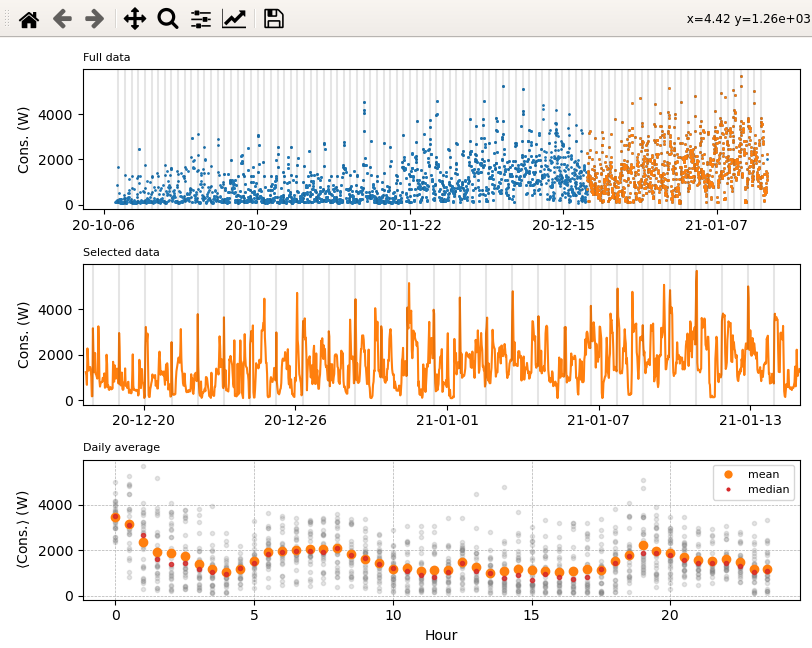

# enedis_data_analysis
Analysis and plot of Enedis (France) consumption data

Once the .csv file is downloaded from the Enedis website, this script reads it and produces plots like the one below.

Usage from python or ipython:
```python
import enedis_analysis
ea = enedis_analysis.Enedis_analyse('Enedis_Conso_Heure_20201001-20210115_24307235764360.csv', c0=3000, c1=-1)
ea.plots(c0=2000,c1=3000)
```



